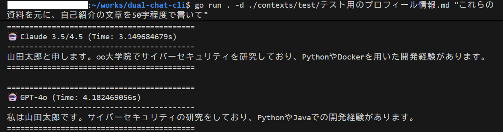

# Dual Chat CLI

  
   
  <i>(プロフィール情報を読み込ませて自己紹介を生成している様子)</i>

OpenAIの **GPT-4o** と Anthropicの **Claude (3.5/4.5)** に同時にリクエストを投げ、回答を比較できるCLIツールです。
ローカルのディレクトリを指定することで、その中の資料（テキストやコード）を読み込ませて回答させる機能も搭載しています。

## 特徴

- **同時並列実行**: Goroutineを使用し、2つのモデルへ同時にリクエストを送信。
- **ローカルRAG**: `-d` オプションでフォルダやファイルを指定すると、中身をコンテキストとして読み込みます。

## 準備

APIキーを環境変数に設定する。

- export OPENAI_API_KEY="ここに入力"
- export ANTHROPIC_API_KEY="ここに入力"

## 使い方

- 質問する時
  - go run . "Go言語の並行処理について教えて"

- 資料を読み込ませて質問する時
  - 資料が入っているフォルダ（またはファイル）を -d オプションで指定します。
  - 読み込むファイルには必ず拡張子（.txt, .md など）を付ける。
  - go run . -d ./contexts "これらの資料を元に、私の強みを分析して"
